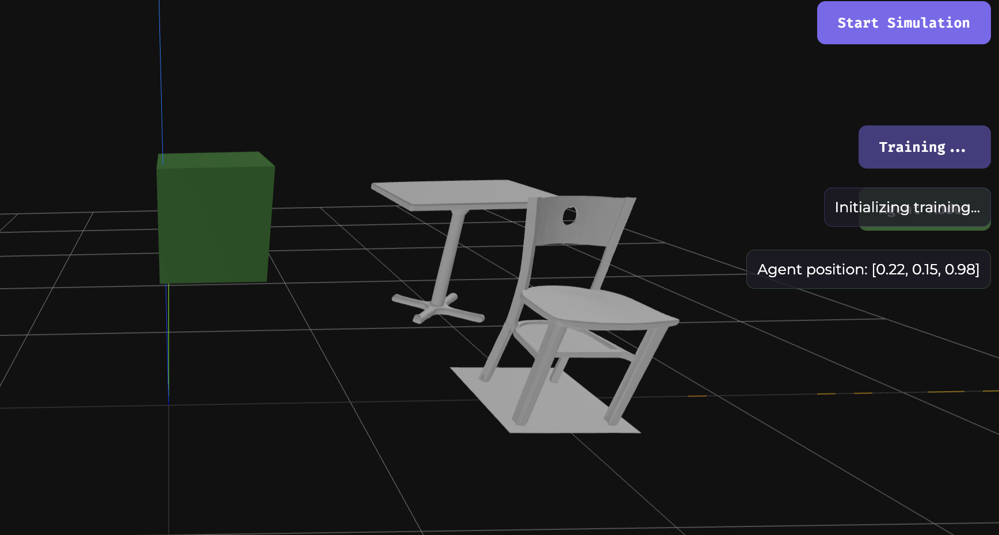
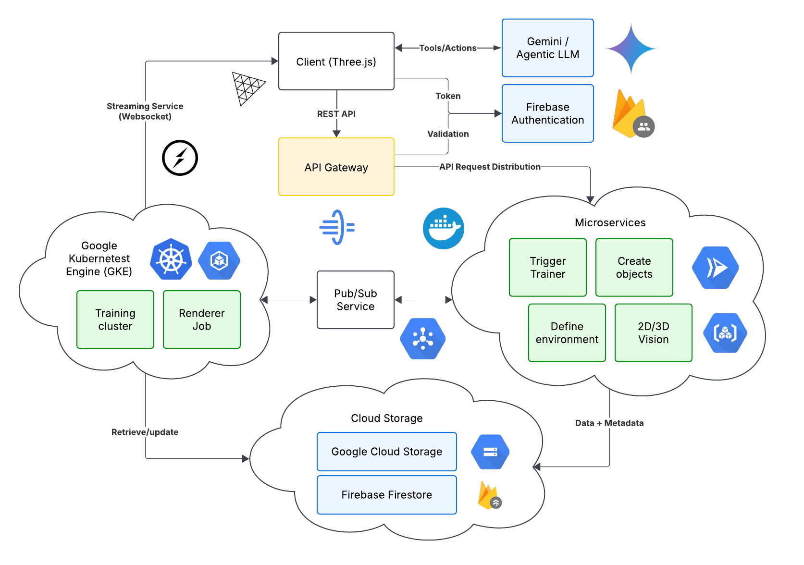
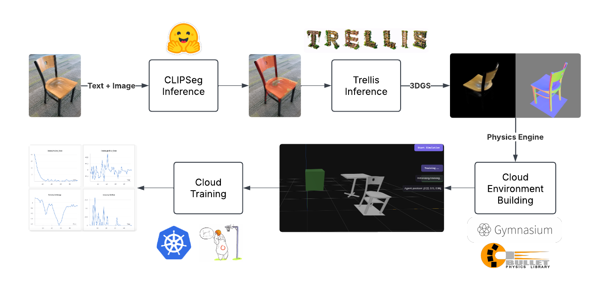

# Trainify

> Watch your AI agents come to life in realistic 3D generated worlds with Trainify.

Trainify simplifies reinforcement learning by enabling users to create and train AI agents in 3D environments directly on the cloud. Leveraging cutting-edge 2D/3D computer vision and reinforcement learning tools, our platform bridges the gap between idea and execution, allowing you to generate complex environments with simple natural language prompts and image references.

## Cloud Architecture

## Generative AI Workflow

Learn more about us at [devpost](https://devpost.com/software/trainify?ref_content=my-projects-tab&ref_feature=my_projects).

## What it does

> Imagine Google Colab (cloud collaboration and computing) + Cursor (agentic editor) + Blender/Unity (3D modelling) but specialized in reinforcement learning.

1. **Creation Interface**: Users can describe their desired environment using natural language prompts with their uploaded reference images for a simplistic workflow.

2. **3D Visualization**: Segment objects of interest using the text prompt and turn images into 3D object representation where you can explore and modify in real time.

3. **Editing Mode**: Intuitive tools allow users to adjust object positions, properties, and relationships within the 3D space with our cloud-based collaborative editor.

4. **Training Mode**: Built-in reinforcement learning capabilities enable users to train AI agents to perform tasks within their custom environments.

5. **AI Assistant**: An integrated Gemini-powered chatbot provides context-aware assistance during every step of the process.

## Internal Documentation

You should refer to files in the `docs` folder.
